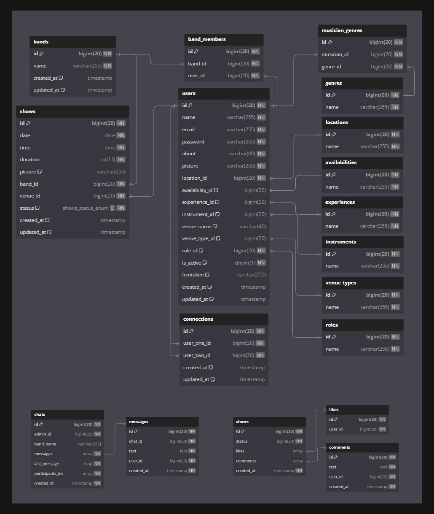

<br><br>

<!-- project philosophy -->


> Muser is a mobile app designed for musicians to connect with each others, spontaneously form bands, book venues, and have their performances livestreamed.
> Muser offers its user base Live streaming, Live messaging, and an AI-powered matchmaking system to form bands effortlessly.

### User Stories

-   As a musician, I want to browse and message musicians to form a band so that I can connect with like-minded individuals.
-   As a musician, I want to view and book available venues so that I can find suitable places to showcase my band's performances and reach a wider audience.
-   As a musician, I want to have my performance livestreamed so that fans and potential collaborators can watch us play in real-time, regardless of their location.

-   As a venue, I want to receive notifications and requests from bands interested in performing so that I can organize exiting events for my customers.
-   As a venue, I want to easily manage bookings through the app so that I can streamline the process and focus on providing a great experience.
-   As a venue, I want to livestream any show happening on my premises, so I can reach a broader audience online and attract more shows in the future.

<br><br>

<!-- Tech stack -->


### Muser is built using the following technologies:

-   [Laravel 11](https://laravel.com/), a PHP framework that provides a robust set of tools for web apps development.
-   [React Native](https://reactnative.dev/), a popular framework for building mobile apps using JavaScript and React, allowing for cross-platform development with a single codebase.
-   [Firebase Cloud Firestore](https://firebase.google.com/products/firestore/), a scalable database from Firebase and Google Cloud Platform. It provides real-time data synchronization, querying, and offline support, making it ideal for building Live applications.
-   [Firebase Cloud Messaging](https://firebase.google.com/products/cloud-messaging/), a cross-platform messaging solution to send notifications reliably to users' devices.
-   [OpenAI](https://openai.com/), a provider of advanced artificial intelligence technologies and APIs. OpenAI powers our AI-driven matchmaking system, enhancing the user experience.
-   [MySQL](https://www.mysql.com/), a widely-used open-source relational database management system. It is known for its reliability, performance, and ease of use, making it an excellent choice for managing and organizing data in web apps.

<br><br>

<!-- UI UX -->


> Muser was designed using wireframes and mockups, iterating on the design until reaching the ideal layout for easy navigation and a seamless user experience.

-   Project design [Figma](https://www.figma.com/design/Bg7RZIYS3dprGnSqn3273D/Muser?node-id=541%3A2275&t=VXzTQUURH5dCvkfB-1)

### Mockups

| Musician Profile                             | Venues                               | Venue Profile                               |
| -------------------------------------------- | ------------------------------------ | ------------------------------------------- |
|  |  |  |

<br><br>

<!-- Implementation -->


### User Screens and Videos (Mobile)

<!-- | Login screen                              | Register screen                         | Landing screen                          | Loading screen                          |
| ----------------------------------------- | --------------------------------------- | --------------------------------------- | --------------------------------------- |
|  |  |  |  |
| Home screen                               | Menu Screen                             | Order Screen                            | Checkout Screen                         |
|  |  |  |  | -->

<table>
  <tr>
    <td style="text-align: center;">
      <h3>Browsing Muser</h3>
      <a href="https://1drv.ms/v/c/84fd3718045c4e7d/IQNeRVmpWktyRYvtwmsKAqdjATqKqOp5gFPwDdMFthZ-EyA">
        
      </a>
    </td>
    <td style="text-align: center;">
      <h3>Forming Bands with Muser Ai</h3>
      <a href="https://1drv.ms/v/c/84fd3718045c4e7d/EV5FWalaS3JFi-3CawoCp2MBpwGcqujol0hUr9rKQEnklA?e=O0FheT">
        
      </a>
    </td>
  </tr>
</table>

<div style="display: flex; justify-content: center; align-items: center; gap: 8px; margin-top: 32px;">
  <div style="text-align: center;">
    <h3>Chatting & Forming Bands</h3>
    <a href="https://1drv.ms/v/c/84fd3718045c4e7d/EfrfbkNIPylIkw539nBJLLABIi46Vp2xF-QzmVR1VdCxig?e=Jxc5vw">
      
    </a>
  </div>

  <div style="text-align: center;">
    <h3>Live Streaming</h3>
    <a href="https://1drv.ms/v/c/84fd3718045c4e7d/EYh-wVOJyGJFrwQsWQXrMjQB8IE_3UCfZ3A1W8avAl9abw?e=eAubdC">
      
    </a>
  </div>
</div>

<br><br>

<!-- Prompt Engineering -->


### Mastering AI Interaction: Unveiling the Power of Prompt Engineering:

We implemented an AI-powered matchmaking system using the latest OpenAI model. By crafting detailed prompts, the AI accurately interprets user input—considering musical genres, locations, required instruments, and experience levels—to dynamically match potential bandmates. This integration enhances the user experience, making finding and forming bands efficient and exciting.

<br><br>

<!-- AWS Deployment -->


### Unleashing the Potential with AWS Integration:

This project leverages AWS deployment strategies to seamlessly integrate and deploy natural language processing models. With a focus on scalability, reliability, and performance, we ensure that AI applications powered by these models deliver robust and responsive solutions for diverse use cases.

<br><br>

<!-- Database Design -->




<br><br>

<!-- Unit Testing -->


<br><br>

<!-- How to run -->


> To set up Muser locally, follow these steps:

### Installation

1. Clone the repository:
    ```sh
    git clone https://github.com/MGeorgesM/muser.git
    ```
2. Navigate to the project directory and install NPM packages:
    ```sh
    cd muser
    npm install
    ```
3. Connect your phone to your computer using a USB cable and ensure that your device is set up for development.
4. Build and run the app on your connected device:

    ```sh
    # Build for Android
    - npx expo run:android
    # Build for iOS
    - npx expo run:ios

    ```

Now, you should be able to run Muser locally and explore its features.
