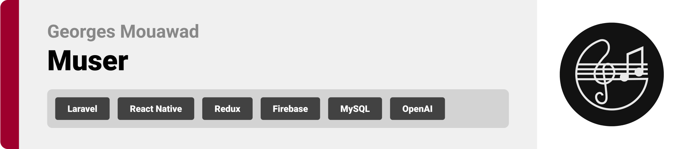
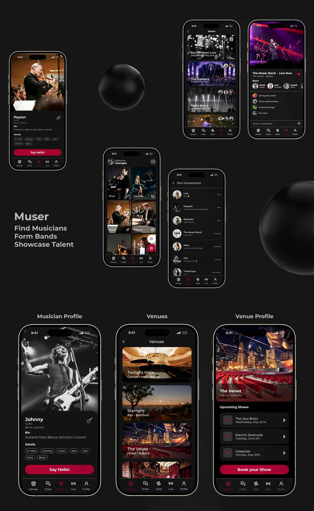
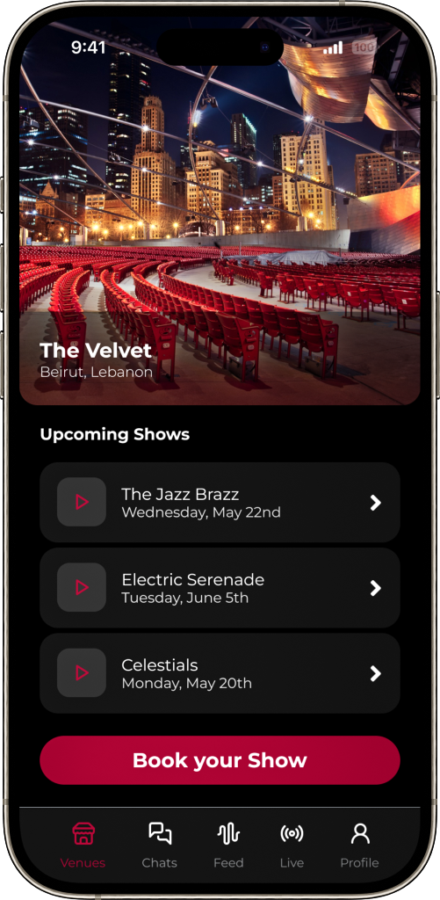

<br><br>

<!-- project philosophy -->


> Muser is a mobile app designed for musicians to connect, spontaneously form bands, book venues, and livestream their performances. It offers live streaming, live messaging, and an AI-powered matchmaking system to effortlessly form bands.

### User Stories:

Musician:

-   As a musician, I want to browse and message musicians to form a band and connect with like-minded individuals.
-   As a musician, I want to book available venues so that I can find suitable places to showcase my band's performances and reach a wider audience.
-   As a musician, I want to have my performance livestreamed so that fans and potential collaborators can watch in real-time, regardless of their location.

Venue:

-   As a venue, I want to receive notifications and requests from bands interested in performing so that I can organize exciting events for my customers.
-   As a venue, I want to easily manage bookings through the app so that I can streamline the process and focus on providing a great experience.
-   As a venue, I want to livestream any show happening on my premises, so I can reach a broader audience online and attract more shows in the future.

<br><br>

<!-- Tech stack -->


### Muser is Built Using the Following Technologies:

-   [Laravel 11](https://laravel.com/): A PHP framework that provides a robust set of tools for web apps development.
-   [React Native](https://reactnative.dev/): A popular framework for building mobile apps using JavaScript and React, allowing for cross-platform development with a single codebase.
-   [Firebase Cloud Firestore](https://firebase.google.com/products/firestore/): A scalable database from Firebase and Google Cloud Platform. It provides real-time data synchronization, querying, and offline support, making it ideal for building Live applications.
-   [Firebase Cloud Messaging](https://firebase.google.com/products/cloud-messaging/): A cross-platform messaging solution to send notifications reliably to users' devices.
-   [OpenAI](https://openai.com/): A provider of advanced artificial intelligence technologies and APIs. OpenAI powers our AI-driven matchmaking system, enhancing the user experience.
-   [MySQL](https://www.mysql.com/): A widely-used open-source relational database management system. It is known for its reliability, performance, and ease of use, making it an excellent choice for managing and organizing data in web apps.

<br><br>

<!-- UI UX -->


### Crafting Muser's UI. By Musicians, For Musicians:

We selected madder red for its bold, energetic appeal. Paired with the Montserrat typeface, known for its modern and clean look, we used wireframes and mockups to iteratively refine Muser's design. The result is an easy-to-navigate, upscale user experience.

-   Project [Figma](https://www.figma.com/design/Bg7RZIYS3dprGnSqn3273D/Muser?node-id=541%3A2275&t=VXzTQUURH5dCvkfB-1)



<!-- <table style="width: 100%; text-align: center;">
  <tr>
    <th>Musician Profile</th>
    <th>Venues</th>
    <th>Venue Profile</th>
  </tr>
  <tr>
    <td>
      
    </td>
    <td>
      
    </td>
    <td>
      
    </td>
  </tr>
</table> -->

<br><br>

<!-- Database Design -->


### Integrating the Best of Both Worlds:

Muser utilizes a relational database (MySQL) and a NoSQL database (Firebase Cloud Firestore).

-   With the power of Laravel Eloquent ORM and the reliability of MySQL, Muser efficiently handles structured data, complex queries, and relationships.
-   Utilizing Google's Firebase Cloud Firestore, Muser offers real-time data synchronization, ensuring users have up-to-date information instantly whether they are chatting, forming bands, or live streaming.


<br><br>

<!-- Implementation -->


### From Design to Reality:

-   The implementation of Muser strictly followed the crafted designs, transitioning from concept to product. Using React Native, every feature and interface was brought to life with precision, matching the initial mockups in every detail.

<table>
  <tr>
      <td align="center">

https://github.com/georgesMouawad/muser/assets/43368919/e0d27b16-d610-4480-86f3-38b9dd14f38c

</td>
      <td align="center">

https://github.com/georgesMouawad/muser/assets/43368919/cb899002-3b8e-4049-b52b-deb6c75e024d

</td>
      <td align="center">
        
https://github.com/georgesMouawad/muser/assets/43368919/231012af-852c-476b-9c1b-1b38af5c0808

</td>
</table>

<table>
  <tr>
      <td align="center">

https://github.com/georgesMouawad/muser/assets/43368919/1378b7ea-2055-47c9-9ef1-4c9380fc8266

</td>
      <td align="center">
  
https://github.com/georgesMouawad/muser/assets/43368919/4c605a21-31e3-4c7d-a6e1-2aeb5f31c39c

</td>
</table>

<br><br>

<!-- Prompt Engineering -->


### Revolutionizing Band Formation with AI:

-   We implemented an AI-powered matchmaking system using the latest OpenAI model. By crafting detailed prompts, the AI accurately interprets user input—considering musical genres, locations, required instruments and experience levels—to dynamically match potential bandmates. This integration enhances the user experience, making finding and forming bands efficient and exciting.


<br><br>

<!-- AWS Deployment -->


### Future Proofing with AWS:

-   By deploying the Laravel backend on AWS, Muser benefits from the comprehensive suite of services and tools that AWS offers, providing a solid foundation for future growth and enhancements.


<!-- By following these steps, we deployed our Laravel server on an AWS EC2 instance, ensuring a scalable and robust environment.

1. **Launch an EC2 Instance:**

    - Sign in to our AWS Management Console.
    - Navigate to the EC2 Dashboard and click "Launch Instance."
    - Choose an Amazon Machine Image (AMI). For a Laravel application, a Ubuntu Server is recommended.
    - Select an instance type (e.g., t2.micro for free tier eligibility).
    - Configure instance details and add storage as needed.
    - Add tags (optional) and configure security groups to allow HTTP, HTTPS, and SSH traffic.
    - Review and launch the instance, creating a new key pair or using an existing one for SSH access.

2. **Connect to Your EC2 Instance:**

    - Open our terminal and connect to the instance using SSH:
        ```sh
        ssh -i /path/to/key-pair.pem ubuntu@ec2-public-ip
        ```

3. **Install Required Software:**

    - Update the package list:
        ```sh
        sudo apt update
        ```
    - Install Apache, PHP, and other necessary extensions:
        ```sh
        sudo apt install apache2 php libapache2-mod-php php-mysql php-xml php-mbstring php-zip php-curl
        ```
    - Install Composer:
        ```sh
        sudo apt install composer
        ```

4. **Clone Your Laravel Project:**

    - Navigate to the web root directory:
        ```sh
        cd /var/www/html
        ```
    - Clone our Laravel project from GitHub:
        ```sh
        sudo git clone https://github.com/georges-mouawad/muser.git
        ```
    - Change the directory to our project:
        ```sh
        cd muser
        ```

5. **Set Permissions and Environment Configuration:**

    - Set the correct permissions for Laravel directories:
        ```sh
        sudo chown -R www-data:www-data /var/www/html/msuer
        sudo chmod -R 775 /var/www/html/muser/storage /var/www/html/muser/bootstrap/cache
        ```
    - Copy the `.env.example` file to `.env` and update it with our configuration:
        ```sh
        cp .env.example .env
        sudo nano .env
        ```
    - Generate the application key:
        ```sh
        php artisan key:generate
        ```

6. **Configure Apache for Laravel:**

    - Create a new Apache configuration file for our Laravel project:
        ```sh
        sudo nano /etc/apache2/sites-available/muser.conf
        ```
    - Add the following configuration:
        ```apache
        <VirtualHost *:80>
            ServerAdmin admin@example.com
            DocumentRoot /var/www/html/muser/api/public
            ServerName our-domain.com
            <Directory /var/www/html/muser>
                Options Indexes FollowSymLinks
                AllowOverride All
                Require all granted
            </Directory>
            ErrorLog ${APACHE_LOG_DIR}/error.log
            CustomLog ${APACHE_LOG_DIR}/access.log combined
        </VirtualHost>
        ```
    - Enable the new site and rewrite module:
        ```sh
        sudo a2ensite muser.conf
        sudo a2enmod rewrite
        sudo systemctl restart apache2
        ```

7. **Set Up Your Database:**

    - Install MySQL server:
        ```sh
        sudo apt install mysql-server
        ```
    - Secure the installation:
        ```sh
        sudo mysql_secure_installation
        ```
    - Log in to MySQL and create a new database and user:
        ```sh
        sudo mysql -u root -p
        ```
        ```sql
        CREATE DATABASE our_database_name;
        CREATE USER 'our_username'@'localhost' IDENTIFIED BY 'our_password';
        GRANT ALL PRIVILEGES ON our_database_name.* TO 'our_username'@'localhost';
        FLUSH PRIVILEGES;
        EXIT;
        ```
    - Update our `.env` file with the database credentials.

8. **Run Migrations and Seeders:**

    - Run Laravel migrations and seeders:
        ```sh
        php artisan migrate --seed
        ```

9. **Accessing the Laravel Application:**
    - Open browser and navigate to the public IP or domain of our EC2 instance to see our Laravel application in action. -->

<br><br>

<!-- Unit Testing -->


### Precision in Development, Unit Testing:

-   By evaluating our API, we ensure a robust foundation, allowing potential issues to be identified and addressed early in the development process. Laravel's unit testing was used to test the API controllers, providing accurate and reliable functionality.


<br><br>

<!-- How to run -->


### Installation:

To set up Muser locally, follow these steps:

1. Clone the repository:
    ```sh
    git clone https://github.com/georgesMouawad/muser.git
    ```
2. Navigate to the project directory and install NPM packages:
    ```sh
    cd muser
    npm install
    ```
3. Connect your phone to your computer using a USB cable and ensure that your device is set up for development.
4. Build and run the app on your connected device:

    ```sh
    # Build for Android
    - npx expo run:android
    # Build for iOS
    - npx expo run:ios

    ```

Now, you should be able to run Muser locally and explore its features.
